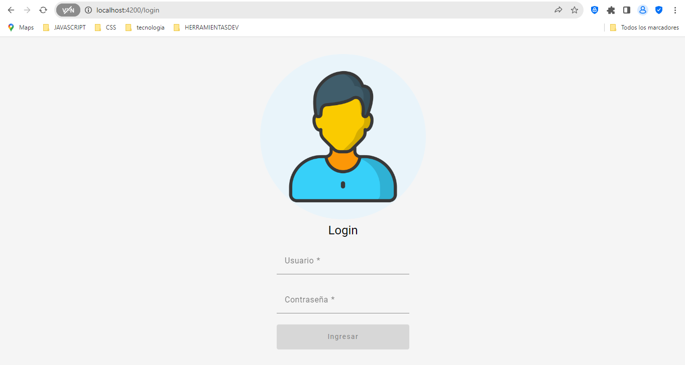

# AngularE2

This project was generated with [Angular CLI](https://github.com/angular/angular-cli) version 17.0.7.

## Development server

Run `ng serve` for a dev server. Navigate to `http://localhost:4200/`. The application will automatically reload if you change any of the source files.

<h1>Pasos:</h1>
<h2>1. <strong>Para el ingreso del proyecto</strong> <h2>

<h5>Acceder con el Usuario: admin y Contraseña: admin123. ✔️</h5>

<h2>2. <strong>Acceder a la sección Registro </strong> </h2>

<h5>En esta seccion ubicar y crear en la tabla el registro de personal de la academia. 🎓📜</h5>

<h2>3. <strong>Ya ubicado en la seccion de Crear Usuario. Completar el formulario.</strong></h2>

<h4>Una vez completado puede ir a la seccion de Registro. si quiere modificar o eliminar el registro
realizado, puede hacerlo en las opciones señaladas.</h4>

<h2>4. <strong>Ya ubicado en la seccion de Reportes.</strong></h2>

<h4>Analizar los promedios de ingreso de estudiantes a la academia.</h4>

<h5>Ya finalizado el registro espero pueda disfrutar este CRUD, realizado para la entrega 2 de 
la academia coderhouse. 🎓📜📚 </h5>
